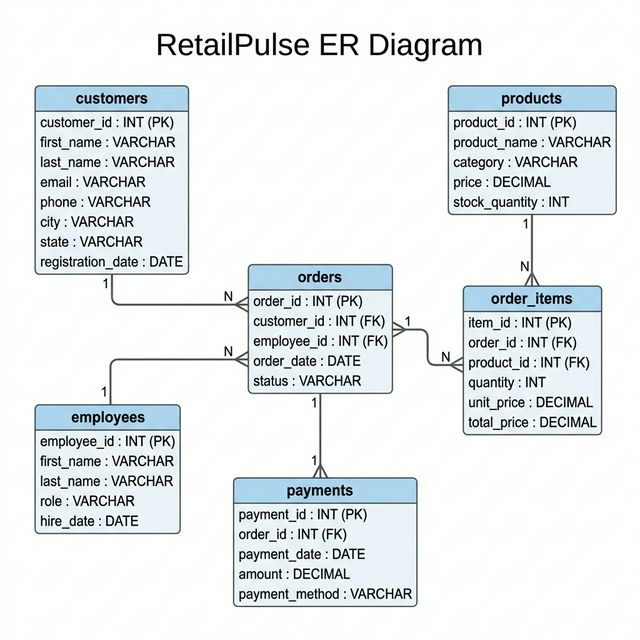

# RetailPulse: SQL Data Analysis Project

This project analyzes sales, customer behavior, and product trends for **RetailPulse**, an online store that sells products across major Indian cities.

The analysis uses SQL on a SQL database containing one year of sales records (January to December 2025). The data includes 200 customers, 50 products, 1,000 orders, and 15 employees.

> [!NOTE]
> - To establish a realistic business scenario, AI assistance was used for developing the synthetic data scripts and refining SQL query comments for a better presentation. 
> - All analytical logic, SQL query design, insights interpretation and business findings were independently conducted.

---

## Tech Stack

| Layer | Tool |
|---|---|
| Database | MySQL / MS SQL Server |
| Query Language | SQL |
| Data Generation | Python 3.x |
| Documentation | Markdown |

---

## Database Schema

The database consists of 6 interrelated tables:

```
customers ──┐
             ├──► orders ──┬──► order_items ◄── products
employees ──┘              │
                           └──► payments
```

| Table | Rows | Description |
|---|---|---|
| `customers` | 200 | Customer demographics and registration details |
| `products` | 50 | Product catalog across 5 categories |
| `employees` | 15 | Sales team with roles |
| `orders` | 1,000 | Order headers with status tracking |
| `order_items` | ~2,300 | Individual line items per order |
| `payments` | 1,000 | Payment records linked to orders |

### Entity Relationship Diagram


---

## Methodology

The project followed a structured analytical journey:

1. **Table Design**: A set of linked tables was designed to store information without redundancy. This included establishing links between customers, orders, and products.
2. **Data Creation**: Python scripts were used to generate realistic sales data featuring holiday spikes and typical shopping patterns. 
3. **Query Building**: Analysis queries were developed to address specific business questions, ranging from simple totals to advanced ranking logic.
4. **Analysis of Findings**: Query results were evaluated in a business context to identify trends and patterns.
5. **Synthesis**: Findings were summarized with actionable suggestions in the insights report.

---

## Data Organization Rationale

- **Reducing Redundancy**: Information was split into distinct tables (such as separating "orders" from "order items") to ensure data is not duplicated.
- **Data Integrity**: Every order is linked to a valid customer and employee to maintain consistency across the database.
- **Performance Filtering**: An order "status" field allows for efficient exclusion of canceled or returned orders during revenue calculations.
- **Pre-calculated Fields**: A total price for each item was included to simplify query logic and improve performance.

---

## Project Structure

```
RetailPulse/
├── README.md
├── goal.md
├── dataset/               ← CSV source files
├── scripts/               ← Python scripts for data generation
├── schema/                ← DDL and INSERT scripts
│   ├── create_tables.sql
│   └── insert_data.sql
├── sql_queries/           ← analysis queries
├── analysis/              ← Reports and findings
│   ├── business_findings.md
│   └── insights_summary.md
└── assets/
    └── er_diagram.png
```

---

## Analysis Queries

| # | Query | Business Question |
|---|-------|-------------------|
| 01 | Total Sales | Total revenue from completed orders |
| 02 | Top Selling Products | Top 10 products by quantity |
| 03 | Customers With No Orders | Registered customers who never ordered |
| 04 | Monthly Revenue Trend | Month-over-month revenue for 2025 |
| 05 | Best Performing Category | Highest-revenue product category |
| 06 | Repeat Customers | Customers with more than one order |
| 07 | Employee Performance | Sales reps ranked by revenue handled |
| 08 | Running Total Sales | Cumulative daily revenue |
| 09 | Rank Top Customers | Top 5 spenders by total value |
| 10 | Products Never Purchased | Catalog items with zero sales |
| 11 | Average Order Value | Mean, min, and max order totals |
| 12 | Customer Retention | Re-orders within 90 days |
| 13 | Sales by City | Revenue by customer location |
| 14 | High Value Orders | Orders exceeding ₹10,000 |
| 15 | Revenue by Payment Method | Revenue breakdown by payment type |

---

## Setup Instructions

### MySQL

```sql
-- 1. Create the database
CREATE DATABASE retailpulse;
USE retailpulse;

-- 2. Run the schema script
SOURCE schema/create_tables.sql;

-- 3. Load the data
SOURCE schema/insert_data.sql;

-- 4. Run any query from sql_queries/
SOURCE sql_queries/01_find_total_sales.sql;
```

### MS SQL Server

```sql
-- 1. Create the database
CREATE DATABASE RetailPulse;
GO
USE RetailPulse;
GO

-- 2. Run create_tables.sql via SSMS or sqlcmd
-- 3. Run insert_data.sql
-- 4. Execute queries (use the MS SQL variant comments where noted)
```

---

## Key Findings

A summary of the business insights derived from the analysis is available in:

- **[`analysis/business_findings.md`](analysis/business_findings.md)**: Query-by-query results
- **[`analysis/insights_summary.md`](analysis/insights_summary.md)**: Executive summary with recommendations

---

## License

This project is open source and available for educational purposes.
